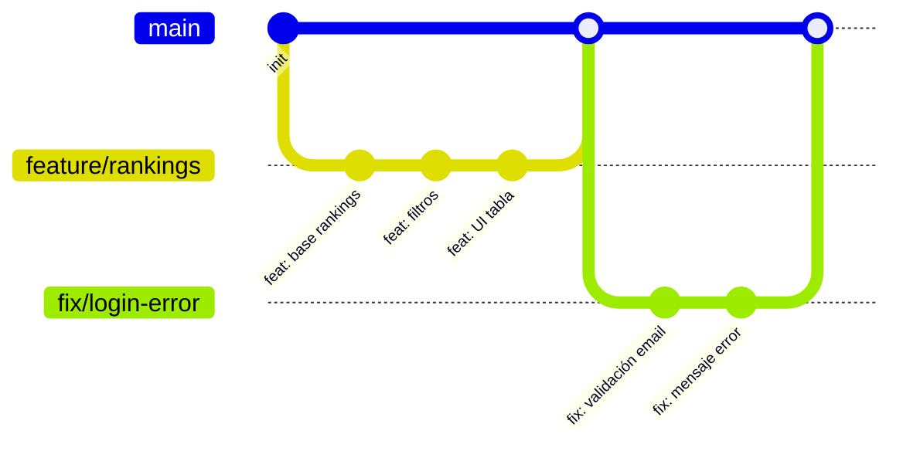
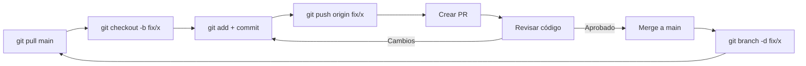

<div align="center">


<br/>


</div>

<br/>

---

## ¿Qué es GitHub Flow?

> [!NOTE]
> Flujo de trabajo basado en ramas ligeras. Un solo branch principal (`main`) y ramas temporales para cada funcionalidad, corrección o experimento. Todo cambio entra vía **Pull Request** revisado.



<br/>

---

## Reglas Base

<div align="center">

| | Regla | Explicación |
|---|---|---|
| :one: | **Rama por tarea** | Cada funcionalidad o fix en su propia rama desde `main` |
| :two: | **Sin commits directos a `main`** | `main` siempre protegido, solo entra por PR |
| :three: | **PR revisado** | Todo merge requiere al menos una revisión |
| :four: | **Rama efímera** | Se borra después de mergear, tanto local como remota |
| :five: | **PR pequeño** | Una sola responsabilidad por PR, fácil de revisar |

</div>

<br/>

---

## Flujo Completo

### Preparación Inicial

```bash
git config --global user.name "Tu Nombre"
git config --global user.email "tu@email.com"
```

Clonar el repositorio:

```bash
git clone https://github.com/gpb-codes/Vyntrix.git
cd Vyntrix
```

<br/>

---

## 1. Desde la Terminal

### 1.1 Sincronizar `main`

Antes de empezar, asegúrate de tener la última versión:

```bash
git checkout main
git pull origin main
```

> [!TIP]
> Siempre haz `git pull` antes de crear una rama nueva. Así evitas conflictos más adelante.

### 1.2 Crear rama de trabajo

```bash
git checkout -b fix/login-error
```

<details>
<summary><b>Convención de nombres</b></summary>

| Prefijo | Uso | Ejemplo |
|---------|-----|---------|
| `feature/` | Nueva funcionalidad | `feature/ranking-semanal` |
| `fix/` | Corrección de bug | `fix/error-500-entrenamientos` |
| `refactor/` | Refactorización | `refactor/service-layer` |
| `docs/` | Documentación | `docs/api-guia` |
| `chore/` | Mantenimiento | `chore/actualizar-deps` |
| `test/` | Pruebas | `test/auth-integration` |

</details>

### 1.3 Hacer cambios y commitear

```bash
# Ver qué cambió
git status
git diff

# Agregar archivos específicos
git add src/auth/login.service.ts

# O agregar todo (revisar antes con git status)
git add .

# Committear
git commit -m "fix: corrige validación de email en login"
```

**Estructura del mensaje de commit:**

```
<tipo>: <descripción imperativa en presente>
```

| Tipo | Significado |
|------|-------------|
| `feat` | Nueva funcionalidad |
| `fix` | Corrección de bug |
| `refactor` | Cambio sin agregar funcionalidad ni corregir bug |
| `docs` | Cambios en documentación |
| `style` | Formato, estilos, sin lógica |
| `test` | Agregar o corregir pruebas |
| `chore` | Tareas de mantenimiento |

Ejemplos:

```bash
git commit -m "feat: agrega filtro por fecha a rankings"
git commit -m "fix: corrige error 500 al crear entrenamiento"
git commit -m "refactor: extrae lógica de validación a helper"
git commit -m "docs: actualiza README con endpoints"
```

### 1.4 Publicar rama en remoto

```bash
git push origin fix/login-error
```

Si es la primera vez que subes esa rama, Git crea el tracking automático. Para ramas existentes:

```bash
git push
```

### 1.5 Crear Pull Request

Desde la terminal puedes abrir el navegador directo al repo:

```bash
# Si tienes GitHub CLI
gh pr create --base main --head fix/login-error --title "fix: corrige validación de email" --body "Descripción del cambio"
```

O manualmente desde GitHub:

1. Ve al repositorio en GitHub
2. Haz clic en **Pull Requests** → **New Pull Request**
3. Base: `main` ← Compare: `fix/login-error`
4. Título descriptivo
5. Cuerpo del PR:

```markdown
## Qué hace
Corrige la validación de email en el formulario de login para que acepte dominios con subdominios.

## Por qué
Los usuarios con emails tipo `user@sub.dominio.com` recibían error 400 inválido.

## Cómo se probó
- Test manual con 5 casos de email válido
- Test manual con 3 casos de email inválido
- Unit test actualizados
```

6. Asigna un reviewer
7. Envía el PR

### 1.6 Revisar y mergear

Durante la revisión:

```bash
# Si hay cambios solicitados, hazlos y sube más commits
git add src/auth/login.service.ts
git commit -m "fix: aplica correcciones de PR"
git push
```

Cuando el PR está aprobado, hay tres formas de mergear:

| Tipo | Comando | Resultado |
|------|---------|-----------|
| **Squash and merge** :star: | `gh pr merge --squash` | Un solo commit en `main`, historial limpio |
| **Rebase and merge** | `gh pr merge --rebase` | Commit único sin merge commit extra |
| **Merge commit** | `gh pr merge` | Commit de merge tradicional |

> [!IMPORTANT]
> **Preferir Squash and merge**. Mantiene el historial de `main` lineal y legible.

### 1.7 Limpiar

Después del merge, limpia tu entorno local:

```bash
# Volver a main y traer el merge
git checkout main
git pull origin main

# Borrar rama local
git branch -d fix/login-error

# Borrar rama remota (opcional, GitHub la borra si configuras auto-delete)
git push origin --delete fix/login-error
```

<br/>

---

## 2. Desde GitHub Desktop

### 2.1 Instalación

1. Descarga desde [desktop.github.com](https://desktop.github.com/)
2. Inicia sesión con tu cuenta de GitHub
3. Clona el repo: **File** → **Clone Repository** → `gpb-codes/Vyntrix`

### 2.2 Sincronizar

```
Repository → Pull (o Ctrl+Shift+P)
```

Siempre antes de crear una rama nueva, asegúrate de que `main` diga **"Last fetched: just now"**.

### 2.3 Crear rama

```
Branch → New Branch (o Ctrl+Shift+N)
```

| Campo | Valor |
|-------|-------|
| Name | `feature/ranking-semanal` |
| Based on | `main` (por defecto) |

### 2.4 Hacer cambios

1. Editas archivos en VS Code o tu editor
2. GitHub Desktop muestra los cambios automáticamente
3. Revisa los diffs en la pestaña **Changes**
4. Abajo escribe:
   - **Summary** (obligatorio): `feat: agrega ranking semanal`
   - **Description** (opcional): detalle del cambio
5. Dale a **Commit to feature/ranking-semanal**

### 2.5 Publicar y abrir PR

```
Publish branch (primera vez)
Branch → Create Pull Request (abre el navegador)
```

En el navegador:
- Completar título y descripción
- Asignar reviewer
- Enviar PR

### 2.6 Después del merge

```
Branch → Switch to main
Repository → Pull
Branch → Delete... (seleccionas la rama mergeada)
```

<br/>

---

## Resumen Visual del Ciclo



<br/>

---

## Comparativa Rápida

<div align="center">

| Paso | Terminal | GitHub Desktop |
|------|----------|----------------|
| 1 | `git checkout main && git pull` | `Repository → Pull` |
| 2 | `git checkout -b fix/x` | `Branch → New Branch` |
| 3 | `git add . && git commit -m "msg"` | Escribir Summary + Commit |
| 4 | `git push origin fix/x` | `Publish branch` |
| 5 | `gh pr create` o web | `Branch → Create PR` |
| 6 | Merge desde web | Merge desde web |
| 7 | `git branch -d fix/x` | `Branch → Delete...` |

</div>

<br/>

---

## Buenas Prácticas

| Práctica | Detalle |
|----------|---------|
| :dart: **PR pequeño** | Una funcionalidad o fix por rama. Máximo 200-300 líneas |
| :memo: **Commits claros** | Usa el formato `tipo: descripción`. No uses mensajes genéricos |
| :arrows_counterclockwise: **Squash and merge** | Mantén `main` limpio, un solo commit por feature |
| :broom: **Limpia ramas** | Borra la rama después de mergear, local y remota |
| :speech_balloon: **Describe el PR** | Explica qué hace, por qué y cómo se probó |
| :mag: **Review obligatorio** | Nunca mergees tu propio PR sin al menos un reviewer |
| :construction: **Mantén `main` verde** | No rompas la rama principal. Siempre prueba antes del PR |

<br/>

---

## Comandos de Emergencia

```bash
# Olvidaste crear rama y commitiaste en main
git reset HEAD~1
git checkout -b feature/nueva-rama
git add .
git commit -m "feat: mueve commit a su rama"

# Conflictos al mergear
git merge main
# Resuelve conflictos manualmente, luego:
git add .
git commit -m "fix: resuelve conflictos con main"

# Ya mergeaste y falta borrar la rama remota
git push origin --delete fix/login-error

# Quieres descartar todo y empezar de nuevo
git checkout main
git branch -D fix/login-error
git pull origin main
git checkout -b fix/login-error
```

<br/>

---

<div align="center">


<br/>

<sub><b>GitHub Flow v1.0</b> · Vyntrix · Julio 2026</sub>
<br/>
<sub><a href="README.md">← Volver al README principal</a></sub>

</div>
