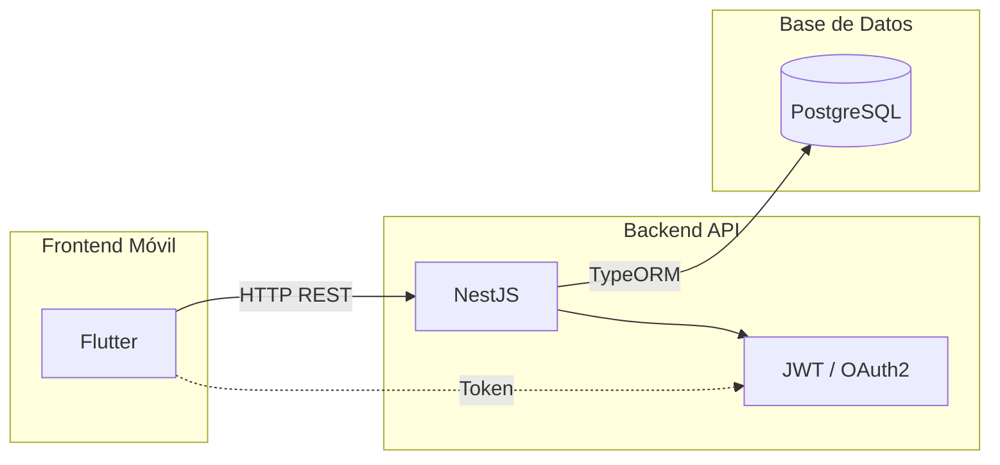
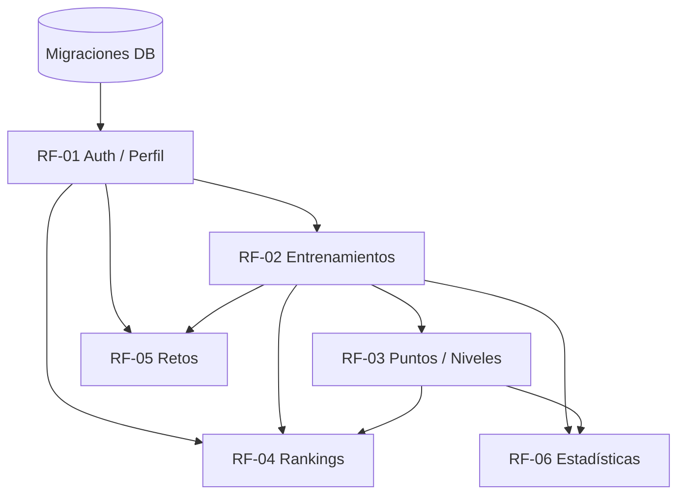

 

 

 

---

## Sobre Vyntrix

> [!IMPORTANT]
> Plataforma deportiva que combina **seguimiento de entrenamiento**, **gamificación** y **rankings competitivos** para llevar tu rendimiento al siguiente nivel.

Vyntrix permite a los deportistas registrar sus entrenamientos, ganar puntos y niveles, competir en rankings y enfrentarse a retos. Todo en una experiencia móvil fluida construida con **Flutter** y potenciada por **NestJS** sobre **PostgreSQL**.

 

---

## Stack Tecnológico

| | | | | | | | |
|---|---|---|---|---|---|---|---|
|  Flutter |  Dart |  NestJS |  Node.js |  TypeScript |  PostgreSQL |  Docker |  AWS/Azure |

 

---

## Arquitectura

 

---

## Equipos de Trabajo

<table>
  <tr>
    <td width="25%" style="background: linear-gradient(135deg, #1a1a2e 0%, #16213e 100%); border-radius: 16px; padding: 20px; border: 2px solid #8B5CF6;">
      

        
          
        
         
        Full‑Stack · Coordinador
          
        
         
        Perfil · Estadísticas
      

    </td>
    <td width="25%" style="background: linear-gradient(135deg, #1a1a2e 0%, #16213e 100%); border-radius: 16px; padding: 20px; border: 2px solid #3B82F6;">
      

        
          
        
         
        Frontend Flutter
          
        
         
        Gamificación · Rankings
      

    </td>
    <td width="25%" style="background: linear-gradient(135deg, #1a1a2e 0%, #16213e 100%); border-radius: 16px; padding: 20px; border: 2px solid #F59E0B;">
      

        
          
        
         
        Backend NestJS
          
        
         
        Entrenamientos · Retos
      

    </td>
    <td width="25%" style="background: linear-gradient(135deg, #1a1a2e 0%, #16213e 100%); border-radius: 16px; padding: 20px; border: 2px solid #06B6D4;">
      

        
          
        
         
        Base de Datos
          
        
         
        PostgreSQL
      

    </td>
  </tr>
</table>

 

---

## Módulos Funcionales

<table>
  <tr>
    <td width="10%" align="center"></td>
    <td width="25%"><b>Cuenta y Perfil Deportivo</b></td>
    <td width="65%">Registro, autenticación JWT/OAuth y perfil deportivo del usuario</td>
  </tr>
  <tr>
    <td align="center"></td>
    <td><b>Registro de Entrenamientos</b></td>
    <td>Creación, edición y consulta de sesiones con tipo, duración e intensidad</td>
  </tr>
  <tr>
    <td align="center"></td>
    <td><b>Puntos, Niveles y Logros</b></td>
    <td>Sistema de gamificación que recompensa la consistencia y el rendimiento</td>
  </tr>
  <tr>
    <td align="center"></td>
    <td><b>Rankings Competitivos</b></td>
    <td>Tablas de clasificación semanales, mensuales y globales</td>
  </tr>
  <tr>
    <td align="center"></td>
    <td><b>Sistema de Retos</b></td>
    <td>Desafíos entre usuarios con objetivos y recompensas</td>
  </tr>
  <tr>
    <td align="center"></td>
    <td><b>Panel de Rendimiento</b></td>
    <td>Dashboard con estadísticas, gráficos y evolución del deportista</td>
  </tr>
</table>

 

---

## Dependencias entre Módulos

 

---

## Hoja de Ruta

<table>
  <tr>
    <td width="33%" style="background: linear-gradient(135deg, #1a1a2e 0%, #16213e 100%); border-radius: 16px; padding: 20px; border: 2px solid #8B5CF6;" valign="top">
      

        
         
        
          
        :white_check_mark: Esquema DB y migraciones 
        :hourglass: API REST entrenamientos 
        :hourglass: Pantalla Home Flutter 
        :hourglass: Registro y autenticación 
      

    </td>
    <td width="33%" style="background: linear-gradient(135deg, #1a1a2e 0%, #16213e 100%); border-radius: 16px; padding: 20px; border: 2px solid #F59E0B;" valign="top">
      

        
         
        
          
        :hourglass: API retos y sistema de puntos 
        :hourglass: Perfil de usuario y rankings 
        :hourglass: Panel de estadísticas 
        :hourglass: Consultas optimizadas 
      

    </td>
    <td width="33%" style="background: linear-gradient(135deg, #1a1a2e 0%, #16213e 100%); border-radius: 16px; padding: 20px; border: 2px solid #06B6D4;" valign="top">
      

        
         
        
          
        :hourglass: Integración front‑back 
        :hourglass: QA y pruebas de usuario 
        :hourglass: Ajustes finales 
        :hourglass: Despliegue 
      

    </td>
  </tr>
</table>

 

---

## Onboarding y Flujo de Trabajo

<table>
  <tr>
    <td width="50%" style="background: linear-gradient(135deg, #1a1a2e 0%, #16213e 100%); border-radius: 16px; padding: 24px; border: 2px solid #8B5CF6;">
      

        
          
        Guía completa de uso con terminal y GitHub Desktop
          
        
      

    </td>
    <td width="50%" style="background: linear-gradient(135deg, #1a1a2e 0%, #16213e 100%); border-radius: 16px; padding: 24px; border: 2px solid #F59E0B;">
      

        
          
        Plan de incorporación full‑stack: PostgreSQL, React, NestJS y patrones
          
        
      

    </td>
  </tr>
</table>

 

---

## Recursos Tecnológicos

<table>
  <tr>
    <td align="center" style="background: rgba(139, 92, 246, 0.1); border: 1px solid #8B5CF6; border-radius: 12px; padding: 16px; width: 50%;">
      
        
      
      
    </td>
    <td align="center" style="background: rgba(59, 130, 246, 0.1); border: 1px solid #3B82F6; border-radius: 12px; padding: 16px; width: 50%;">
      
        
      
      
    </td>
  </tr>
  <tr>
    <td align="center" style="background: rgba(245, 158, 11, 0.1); border: 1px solid #F59E0B; border-radius: 12px; padding: 16px;">
      
        
      
      
    </td>
    <td align="center" style="background: rgba(6, 182, 212, 0.1); border: 1px solid #06B6D4; border-radius: 12px; padding: 16px;">
      
        
      
      
    </td>
  </tr>
  <tr>
    <td align="center" style="background: rgba(239, 68, 68, 0.1); border: 1px solid #EF4444; border-radius: 12px; padding: 16px;" colspan="2">
      
      
        
      
      
      
    </td>
  </tr>
</table>

 

---

## Guías del Repositorio

| Guía | Descripción |
|------|-------------|
| [`GITHUB_FLOW.md`](GITHUB_FLOW.md) | Flujo de trabajo con ramas, PRs y despliegue continuo |
| [`ONBOARDING.md`](ONBOARDING.md) | Plan de incorporación técnica full-stack |

 

---

## Contacto

<table>
  <tr>
    <td style="background: linear-gradient(135deg, #8B5CF6 0%, #3B82F6 100%); border-radius: 16px; padding: 24px;">
      <table>
        <tr>
          <td align="center" style="padding: 10px 20px;">
            <a href="https://linkedin.com/in/gabriel-pedreros-995935364">
              
               
              Gabriel Pedreros
            </a>
          </td>
          <td align="center" style="padding: 10px 20px;">
            <a href="mailto:gabriel.pedreros.dev@gmail.com">
              
               
              Contáctame
            </a>
          </td>
          <td align="center" style="padding: 10px 20px;">
            <a href="https://gpb-portfolio.pages.dev/">
              
               
              Proyectos
            </a>
          </td>
          <td align="center" style="padding: 10px 20px;">
            <a href="https://github.com/gpb-codes/Vyntrix">
              
               
              Vyntrix
            </a>
          </td>
        </tr>
      </table>
    </td>
  </tr>
</table>

 

---

 

<b>v1.0</b> · Basado en REQ-MVP-001 · Julio 2026
 

·
<a href="GITHUB_FLOW.md">Ver guía</a>

